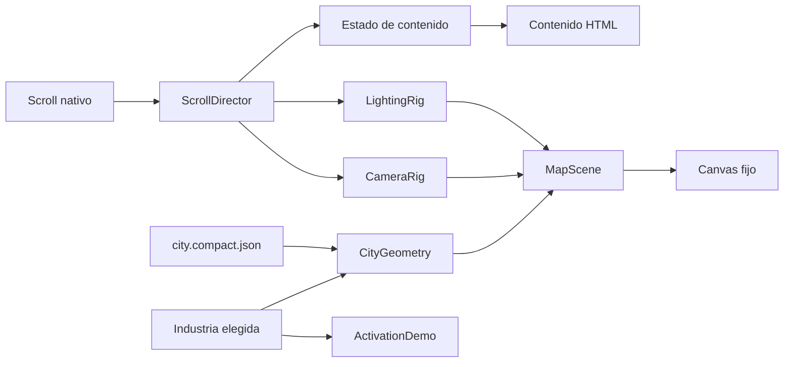

# SDD — hito.uno: portfolio narrativo sobre mapa isométrico

- Estado: propuesta para revisión
- Fecha: 2026-08-25
- Alcance: experiencia pública de `hito.uno`
- Base actual: React + Vite + Cloudflare Workers Assets
- Fuente de producto: `Hito Uno Wireframes.dc.html` entregado por el usuario

## 1. Resumen ejecutivo

`hito.uno` será una landing/portfolio comercial con una ciudad isométrica
minimalista como fondo persistente. El desplazamiento vertical moverá una
cámara ortográfica por diferentes hitos de la ciudad y modulará iluminación,
niebla, color y tráfico. El contenido y los controles permanecerán en HTML
semántico sobre el canvas.

La ciudad partirá de geometría real de OpenStreetMap (OSM), descargada para una
zona pequeña, simplificada fuera del navegador y convertida en un artefacto
local, compacto y determinista. La aplicación publicada no consultará mapas,
tiles ni APIs de geodatos en tiempo de ejecución.

La arquitectura UX recomendada fusiona:

- La explicación inmediata, demo protagonista y cobertura comercial de la
  alternativa 1a del wireframe.
- La continuidad espacial y el eje pegajoso de 1b.
- La personalización por industria de 1c, pero sólo después de explicar qué es
  Hito para no obligar al visitante a elegir sin contexto.

## 2. Problema y objetivo

### 2.1 Problema

Hito conecta objetos físicos con experiencias digitales mediante NFC o QR,
pero una descripción puramente técnica puede reducir el producto a “un QR”. La
landing debe mostrar que el valor reside en la experiencia, la acción y el
sistema administrable que existe detrás del objeto.

### 2.2 Objetivo de producto

Conseguir que una persona que llega por primera vez:

1. Entienda la propuesta en menos de cinco segundos.
2. Pruebe una activación sin necesitar conocimientos técnicos.
3. Reconozca un caso aplicable a su industria.
4. Comprenda que Hito es un sistema, no una impresión aislada.
5. Inicie una conversación comercial con baja fricción.

### 2.3 Métricas de éxito iniciales

- El hero comunica objeto físico → interacción digital sin depender del 3D.
- Al menos un CTA accionable está disponible sin completar el recorrido.
- La demo se puede usar con mouse, teclado y pantalla táctil.
- La experiencia completa funciona sin WebGL mediante un fallback estático.
- El recorrido no captura ni bloquea el scroll nativo.
- El formulario solicita como máximo nombre, rubro y un canal de contacto.

Las tasas comerciales reales se definirán cuando exista analítica y un volumen
de tráfico suficiente; este SDD no inventa objetivos de conversión.

## 3. Decisiones de diseño

### 3.1 Decisiones aceptadas por esta propuesta

1. React Three Fiber + Three.js será la capa de render 3D.
2. Se utilizará una cámara ortográfica con composición isométrica.
3. El progreso de scroll será la fuente de tiempo del recorrido; no habrá una
   animación cinematográfica que avance sola.
4. El contenido comercial, navegación, formulario y accesibilidad vivirán en
   DOM, no dentro de WebGL.
5. La ciudad se derivará de OSM y se estilizará como interpretación artística.
6. La descarga y simplificación ocurrirán mediante un comando de mantenimiento,
   nunca durante `npm run build` ni en el navegador.
7. El tráfico será procedural y ficticio. No representará tránsito real.
8. Desktop recibirá un recorrido continuo; mobile podrá usar transiciones más
   cortas y escenas discretas para proteger legibilidad y rendimiento.

### 3.2 Decisiones pendientes

- D1: ciudad o barrio que servirá de base y su bounding box exacto.
- D2: paleta final y familia tipográfica.
- D3: copy definitivo de industrias, objetos y CTA.
- D4: destino real del formulario comercial.
- D5: si la marca necesita modo claro únicamente o claro/oscuro.

Ninguna de estas decisiones bloquea el prototipo con un fixture sintético.

### 3.3 No objetivos del MVP

- Navegación cartográfica, búsqueda de direcciones o geolocalización.
- Mapa de tiles, zoom libre o controles tipo Google Maps.
- Datos de tráfico en tiempo real.
- Física, colisiones o experiencia de videojuego completa.
- Dashboard funcional del producto Hito.
- CMS o personalización remota por usuario.
- Edificios modelados a mano o assets 3D pesados.

## 4. Arquitectura de información y recorrido

El canvas permanece fijo en el viewport. Cada sección DOM ocupa una porción
medible del documento y declara un estado de escena. La cámara interpola entre
estados, pero la lectura no depende de alcanzar un frame exacto.

| Parada | Contenido UX | Representación en la ciudad | Acción principal |
| --- | --- | --- | --- |
| 0. Vista general | Hero y propuesta de valor | Panorámica isométrica | Probar una experiencia |
| 1. Activación | Objeto + gesto + teléfono | Plaza/laboratorio de activación | Activar el objeto |
| 2. Cómo funciona | Objeto → interacción → experiencia → acción | Cuatro hitos sobre una avenida | Continuar recorrido |
| 3. Soportes | Llave, tarjeta, portavasos, placa, mesa, packaging | Galería o parque de objetos | Explorar soportes |
| 4. Industrias | Bar, inmobiliaria, alojamiento, comercio, eventos | Distritos seleccionables | Elegir contexto |
| 5. Plataforma | Mock de panel y métricas | Torre/centro de control | Ver la capa de software |
| 6. Ecosistema | Comercios, hitos y red | Nodos conectados en el mapa | Entender la visión |
| 7. CTA | Pregunta comercial contextual | Plaza terminal iluminada | Pedir una demo |

### 4.1 Entrada y claridad

El hero debe contener en DOM:

- Marca `hito.uno`.
- Título: “Convertimos objetos físicos en puntos de interacción digital”.
- Una explicación breve sin jerga.
- CTA primario orientado a probar.
- CTA secundario comercial.

La ciudad acompaña esta explicación, pero no debe ser necesaria para entenderla.
El primer contenido útil no esperará a que Three.js termine de cargar.

### 4.2 Demo protagonista

La demo combina la pieza de 1a con el comportamiento sticky de 1b:

- La persona elige una industria.
- El objeto cambia: por ejemplo portavasos, placa o llave.
- Al activar, una onda visual conecta objeto y teléfono.
- El teléfono muestra una experiencia contextual.
- La ciudad ilumina el distrito correspondiente.

La selección no reescribe silenciosamente toda la página. Cambia ejemplos,
labels y CTA, manteniendo estable la estructura para evitar desorientación.

### 4.3 Navegación

- Header persistente y compacto con Producto, Casos, Plataforma y Hablemos.
- Cada enlace hace scroll nativo a una sección y mueve la cámara al mismo estado.
- Se ofrece “Saltar recorrido” cerca del inicio.
- El botón Atrás del navegador no se usará para cada parada; las secciones son
  anchors, no rutas independientes en el MVP.
- Un indicador discreto muestra la parada actual sin competir con el contenido.

### 4.4 Mobile

- Una columna de contenido.
- Canvas detrás, sin bloquear gestos táctiles verticales.
- Menos edificios y vehículos.
- Transiciones de cámara por secciones, no un viaje largo continuo.
- Demo táctil con targets mínimos de 44 × 44 CSS px.
- CTA comercial disponible antes del final desde el header o menú.

## 5. Dirección de arte

### 5.1 Lenguaje visual

- Estética: cartografía de videojuego y ciencia ficción de los años noventa.
- Proyección: ortográfica/isométrica.
- Fondo: marfil, gris niebla o celeste casi blanco.
- Líneas: grafito suave con acentos cyan, lavanda y coral.
- Superficies: relleno mate muy tenue; no vidrio físico ni reflejos costosos.
- Profundidad: fog, variación de valor y escala de detalle.
- Movimiento: lento, deliberado, sin rebotes ni parallax agresivo.

### 5.2 Técnica de wireframe

No se usará `wireframe: true` como único material. La escena combinará:

1. Un mesh de relleno simple para recibir color e iluminación.
2. Bordes derivados con `EdgesGeometry` o líneas anchas sólo cuando aporten
   jerarquía.
3. Un shader opcional y barato para scanline/dither global.

Esto permite que el cambio de iluminación sea visible. Las líneas básicas no
responden a luces y, en WebGL, su ancho suele limitarse a un píxel.

### 5.3 Iluminación narrativa

- Una luz hemisférica estable para legibilidad.
- Una luz direccional sin sombras dinámicas en el MVP.
- Cambios por parada: color, intensidad, fog y exposición.
- Los distritos inactivos reducen saturación/opacidad; no desaparecen de golpe.
- El CTA final concentra el contraste más alto del recorrido.

## 6. Arquitectura técnica



### 6.1 Dependencias previstas

- `three`
- `@react-three/fiber`
- `@react-three/drei`, importando sólo utilidades utilizadas
- Una librería de validación de schema sólo si ya justifica su peso; de lo
  contrario, validación en scripts de build con TypeScript.

No se incorpora GSAP, motor de físicas, MapLibre ni librería de
postprocesamiento en el primer vertical.

### 6.2 Módulos previstos

```text
src/
  app/
    content.ts
    experience-context.ts
  scene/
    MapScene.tsx
    CameraRig.tsx
    LightingRig.tsx
    ScrollDirector.tsx
    CityGeometry.tsx
    TrafficSystem.tsx
    ActivationLandmark.tsx
    SceneFallback.tsx
    scene-contracts.ts
  map/
    generated/
      city.compact.json
      city.manifest.json
scripts/
  maps/
    map-region.json
    map-query.overpassql
    fetch-map.mjs
    normalize-map.mjs
    simplify-map.mjs
    validate-map.mjs
docs/
  SDD-portfolio-mapa-isometrico.md
```

Los nombres son contratos propuestos, no archivos implementados todavía.

### 6.3 Contratos de estado

```ts
type ExperienceContext =
  | 'bar'
  | 'real-estate'
  | 'hospitality'
  | 'retail'
  | 'events'

type SceneStop = {
  id: string
  scrollStart: number
  scrollEnd: number
  cameraPosition: [number, number, number]
  cameraTarget: [number, number, number]
  zoom: number
  lightColor: string
  lightIntensity: number
  fogDensity: number
}

type MapManifest = {
  schemaVersion: 1
  source: 'OpenStreetMap'
  attribution: '© OpenStreetMap contributors'
  licenseUrl: 'https://www.openstreetmap.org/copyright'
  bbox: [south: number, west: number, north: number, east: number]
  snapshotAt: string
  querySha256: string
  artifactSha256: string
}
```

El progreso de scroll se guarda en refs y se aplica dentro del frame de render.
No debe provocar un render React completo por cada evento de scroll.

## 7. Pipeline OpenStreetMap

### 7.1 Principio

OSM es la fuente geométrica, no el estilo final. El proyecto producirá una obra
cartográfica derivada y claramente estilizada. Se conservará trazabilidad del
origen y se mostrará atribución visible.

Referencias:

- [Copyright y licencia de OpenStreetMap](https://www.openstreetmap.org/copyright)
- [Sintaxis y bounding boxes de Overpass QL](https://wiki.openstreetmap.org/wiki/OverpassQL)

### 7.2 Alcance de datos

La región debe ser pequeña: objetivo inicial de hasta 1,5 × 1,5 km. Se extraen:

- Edificios y `building:levels`/`height` cuando existan.
- Calles y clasificación `highway` necesaria para dibujar vías.
- Plazas, parques o agua sólo si ayudan a la composición.
- Líneas ferroviarias o transporte únicamente como geometría ambiental.

No se extraen nombres de personas, historial de edición ni metadata de usuarios.
La consulta utilizará geometría y tags de producto, no `out meta`.

### 7.3 Flujo reproducible

1. **Configurar región.** `map-region.json` contiene bbox, centro, escala y fecha
   de snapshot.
2. **Descargar explícitamente.** `npm run map:fetch` ejecuta una consulta
   versionada `map-query.overpassql` y guarda una entrada cruda temporal.
3. **Normalizar.** Coordenadas geográficas se proyectan a metros y se recentran
   alrededor del origen de la escena.
4. **Filtrar.** Se eliminan tags no usados, geometrías inválidas, interiores
   diminutos y elementos fuera del encuadre.
5. **Simplificar.** Se aplica una tolerancia configurable, preservando esquinas
   de edificios y continuidad de calles.
6. **Derivar alturas.** Se respeta `height`; luego `building:levels × 3 m`; si no
   existe ninguno se usa una altura determinista basada en el ID OSM.
7. **Clasificar vías.** Cada clase recibe ancho y prioridad visual. El tráfico
   procedural sólo utiliza vías aptas seleccionadas.
8. **Compactar.** Se cuantizan coordenadas y se generan arrays compactos para
   edificios, bordes y caminos.
9. **Validar.** Schema, bbox, polígonos, tamaños, hashes y atribución obligatoria.
10. **Versionar.** Se commitean artefacto compacto, manifest y consulta; el dato
    crudo puede quedar en caché local si supera el presupuesto del repositorio.

### 7.4 Reproducibilidad y disponibilidad

- `npm run build` consume únicamente `city.compact.json` versionado.
- CI nunca depende de una instancia pública de Overpass.
- Actualizar el mapa es una acción manual y revisable mediante pull request.
- El manifest registra fecha de snapshot, bbox y hashes.
- Una actualización que supera el presupuesto de tamaño falla antes de commit.
- El pipeline usa un fixture pequeño en tests para no golpear servicios públicos.

### 7.5 Simplificación propuesta

- Edificios: preservar contorno; tolerancia inicial 0,5–1 m.
- Calles: tolerancia inicial 1–2 m, conservando cruces y extremos.
- Descartar footprints menores a un umbral visual configurable.
- Cuantizar coordenadas finales a 0,25–0,5 m.
- Limitar alturas visuales para evitar una torre que rompa el encuadre.
- Semillas deterministas para alturas faltantes, color y tráfico.

Los valores se calibrarán visualmente con el barrio elegido; no se consideran
correctos hasta comparar el resultado simplificado con la fuente.

### 7.6 Atribución y licencia

Se mostrará de forma legible y enlazada:

> Map data © OpenStreetMap contributors · ODbL

La atribución estará fija en una esquina del canvas o en el footer mientras la
escena sea visible, con enlace a `https://www.openstreetmap.org/copyright`.
También se incluirá en README y en `city.manifest.json`. No se copiarán datos de
Google Maps ni de fuentes con licencia incompatible.

## 8. Rendimiento

### 8.1 Presupuestos de producción

| Señal | Desktop | Mobile |
| --- | ---: | ---: |
| JavaScript inicial comprimido | ≤ 300 KiB | ≤ 250 KiB |
| Datos de ciudad comprimidos | ≤ 120 KiB | ≤ 80 KiB o región reducida |
| Draw calls durante recorrido | ≤ 80 | ≤ 50 |
| Triángulos visibles | ≤ 150k | ≤ 70k |
| DPR | ≤ 1,5 | 1–1,25 |
| FPS objetivo durante scroll | 55–60 | ≥ 30 |
| LCP p75 objetivo | ≤ 2,5 s | ≤ 2,5 s |
| CLS | ≤ 0,05 | ≤ 0,05 |

Estos son gates, no deseos. Si el bundle base no permite el presupuesto mobile,
Three.js se carga después del contenido crítico y el fallback queda visible.

### 8.2 Estrategias

- `InstancedMesh` para edificios repetibles y vehículos.
- Geometrías y materiales compartidos.
- Frustum culling y bounding boxes calculadas.
- Cero sombras dinámicas en el MVP.
- Cero texturas fotográficas; como máximo una textura procedural pequeña.
- Render adaptativo: bajar DPR y tráfico durante movimiento intenso.
- Pausar tráfico cuando el documento está oculto o el canvas fuera de viewport.
- Precompilar materiales antes de iniciar el primer recorrido cuando sea viable.
- Medir `renderer.info`, long tasks y Core Web Vitals en builds de prueba.

## 9. Accesibilidad, UX resiliente y SEO

### 9.1 Accesibilidad

- Canvas decorativo con `aria-hidden="true"` cuando no contenga interacción.
- Todos los textos, tabs, controles y CTA existen en DOM.
- Orden de tabulación independiente de la posición visual 3D.
- Estados de foco visibles y contraste WCAG AA.
- Mensajes de la demo anunciados en una región `aria-live="polite"`.
- `prefers-reduced-motion`: cámara por cortes suaves o completamente estática,
  sin tráfico y sin pulsos repetitivos.
- Botón “Reducir movimiento” disponible aunque el sistema no lo solicite.
- Fallback para WebGL ausente, error de contexto o dispositivo muy limitado.

### 9.2 Scroll y mareo

- No scroll hijacking.
- Damping corto y limitado; la cámara alcanza el estado sin retrasarse varios
  segundos respecto del contenido.
- La rotación total entre paradas se limita; se privilegia desplazamiento y zoom.
- No se combinan simultáneamente rotación fuerte, zoom y cambio de iluminación.
- Contenido textual permanece estable mientras el fondo se mueve.

### 9.3 SEO y compartibilidad

- Hero y secciones se entregan como HTML estático desde el primer render.
- Metadata social independiente del canvas.
- Cada sección importante tiene `id` y heading jerárquico.
- El resultado sigue comunicando producto con JavaScript desactivado.

## 10. Analítica y privacidad

Eventos previstos, sólo después de elegir una solución de analítica y política:

- `section_reached`
- `demo_context_selected`
- `demo_activated`
- `support_explored`
- `cta_started`
- `cta_submitted`

No se registrará posición de cámara por frame, movimiento de puntero ni scroll
crudo. La interacción 3D no justifica recolectar telemetría detallada.

## 11. Pruebas y evidencia

### 11.1 Pipeline de mapa

- Fixture OSM pequeño y versionado.
- Misma entrada produce el mismo hash de salida.
- Polígonos cerrados, finitos y dentro de límites.
- Calles mantienen conectividad mínima después de simplificar.
- Manifest y atribución son obligatorios.
- Test de presupuesto de bytes.

### 11.2 Componentes y estado

- Contexto elegido actualiza demo, distrito y CTA.
- Anchors sincronizan sección y parada de cámara.
- Progreso siempre queda en `[0, 1]`.
- Reduced motion evita interpolaciones continuas.
- Fallback aparece ante fallo de WebGL.

### 11.3 E2E visual

Capturas deterministas en cada parada:

- Desktop 1440 × 900.
- Mobile 390 × 844.
- Movimiento reducido.
- WebGL deshabilitado.

Se verifican navegación por teclado, deep links, demo, CTA, consola sin errores y
respuesta correcta de assets desde Cloudflare.

### 11.4 Rendimiento

- Reporte de bundle por commit relevante.
- Conteo de draw calls/triángulos en cada parada.
- Perfil de scroll en desktop medio y mobile emulado.
- Lighthouse como señal secundaria, no sustituto de perfil GPU/frame time.
- Prueba real en al menos un teléfono antes de aprobar producción.

## 12. Plan de implementación SDD

### Fase 0 — Aprobación de dirección

Acciones:

- Aprobar la fusión 1a + 1b con personalización selectiva de 1c.
- Elegir zona OSM y bounding box.
- Aprobar paleta y tono visual mediante 2–3 styleframes.
- Congelar categorías, objetos y CTA del MVP.

Gate G0:

- Una sola arquitectura UX aprobada.
- Una región y atribución aceptadas.
- Contenido mínimo completo para todas las paradas.

### Fase 1 — Vertical UX sin 3D

Acciones:

- Construir estructura DOM, navegación y secciones responsive.
- Implementar demo de objeto/teléfono con gráficos simples.
- Implementar selector de industria y CTA contextual.
- Agregar reduced motion y fallback desde el comienzo.

Gate G1:

- La propuesta se entiende y la demo funciona sin canvas.
- Navegación completa con teclado y mobile.
- Build y pruebas base verdes.

### Fase 2 — Pipeline cartográfico

Acciones:

- Crear query Overpass, config de región y fixture.
- Implementar descarga explícita, normalización y simplificación.
- Generar artefacto y manifest versionados.
- Comparar visualmente fuente vs. geometría derivada.

Gate G2:

- Pipeline determinista.
- Datos dentro del presupuesto.
- Atribución visible y manifest válido.
- No existen llamadas OSM durante build o runtime.

### Fase 3 — Ciudad isométrica estática

Acciones:

- Integrar R3F/Three.js de forma diferida.
- Renderizar suelo, edificios, calles y bordes.
- Aplicar cámara ortográfica, fog y paleta aprobada.
- Instrumentar draw calls, triángulos y DPR.

Gate G3:

- Styleframe reproducido en desktop y mobile.
- Presupuestos de escena estática cumplidos.
- Fallback estable ante WebGL deshabilitado.

### Fase 4 — Dirección por scroll

Acciones:

- Definir paradas y splines de posición/target.
- Sincronizar secciones con cámara e iluminación.
- Agregar navegación directa por anchors.
- Calibrar damping, mareo y reduced motion.

Gate G4:

- Ninguna sección depende de un frame exacto para leerse.
- Scroll nativo sin bloqueos.
- Capturas deterministas de todas las paradas.
- Objetivo de FPS cumplido durante el recorrido.

### Fase 5 — Demo y ciudad conectadas

Acciones:

- Vincular contexto con objeto, distrito, teléfono y CTA.
- Implementar pulso de activación y highlights.
- Agregar galería de soportes y mock de plataforma.
- Agregar tráfico procedural con semilla fija.

Gate G5:

- La demo explica el ciclo completo sin texto técnico adicional.
- Interacciones equivalentes por mouse, teclado y touch.
- Tráfico no rompe presupuestos ni distrae del contenido.

### Fase 6 — Hardening y publicación

Acciones:

- Auditoría de accesibilidad, bundle y performance.
- Pruebas en dispositivo físico.
- Revisión de copy, licencia OSM y metadata social.
- Despliegue de preview y comparación visual.
- Promoción a `hito.uno` sólo con gates verdes.

Gate G6:

- Build, tests, E2E, accesibilidad y presupuestos verdes.
- Producción responde HTML, JS, CSS y datos de mapa con `200`.
- Atribución OSM visible.
- Rollback de Worker identificado antes de promover.

## 13. Riesgos y mitigaciones

| Riesgo | Impacto | Mitigación |
| --- | --- | --- |
| El 3D oculta la propuesta | Alto | Hero DOM inmediato y vertical UX sin 3D primero |
| Bundle pesado en mobile | Alto | Lazy load, budgets, región reducida y fallback |
| Scroll provoca mareo | Alto | Cámara ortográfica, rotación limitada y reduced motion |
| Mapa real produce composición fea | Medio | Elegir bbox por composición y permitir poda artística documentada |
| Datos OSM cambian | Medio | Snapshot, query y hashes versionados |
| Overpass no disponible | Bajo en runtime | Descarga manual; build usa artefacto local |
| Demasiados contornos/draw calls | Alto | Agrupar geometrías, instancing y LOD mobile |
| Contexto cambia demasiadas cosas | Medio | Estructura estable; sólo ejemplos y highlights cambian |
| Formulario sin backend definido | Alto para conversión | D4 debe cerrarse antes de habilitar submit real |

## 14. Criterio de finalización

El proyecto se considera implementado cuando una persona puede comprender,
recorrer, probar y contactar a Hito con o sin WebGL; la escena utiliza un
artefacto OSM reproducible y atribuido; cumple los presupuestos desktop/mobile;
y existe evidencia automatizada y en dispositivo de navegación, accesibilidad,
render y despliegue.
